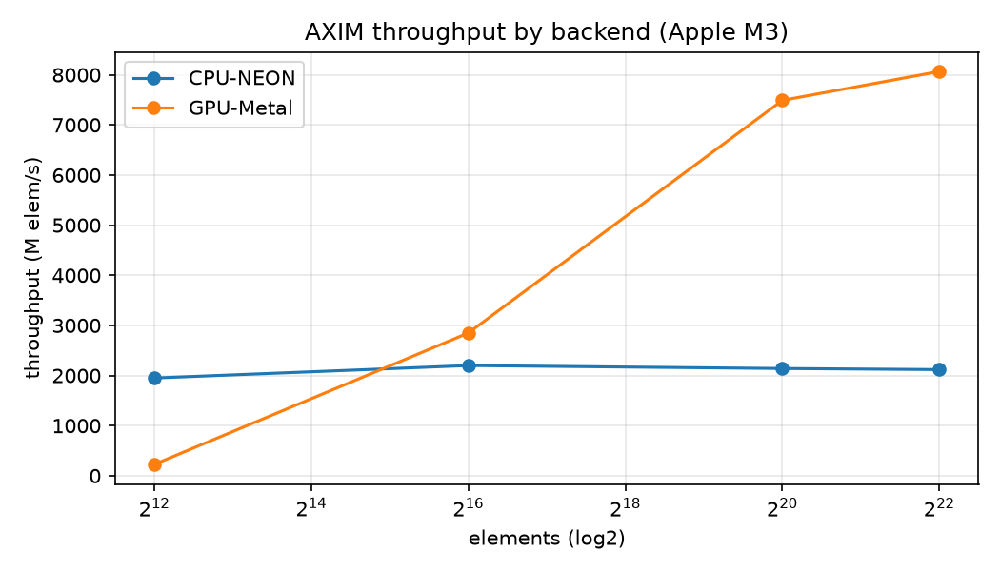
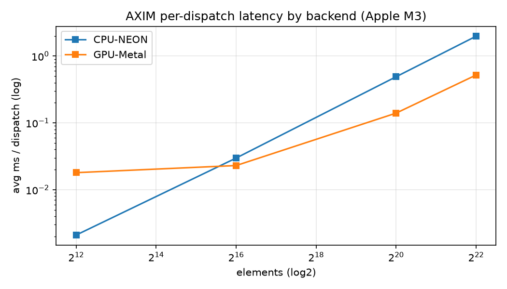

# AXIM: A Universal CUDA-Free Compute and Graphics Runtime

**A Vendor-Neutral Execution Substrate for AI Inference, HPC, and Graphics — with SYNAXIM as a Case Study**

**GRRNMAKER**
<https://github.com/GRRN-MAKER/Aximcomp>
July 2026

---

## Abstract

The dominant substrate for GPU computing — NVIDIA CUDA — creates a single-vendor
dependency that fragments the accelerator ecosystem. Existing alternatives translate or
intercept CUDA (AMD ROCm/HIP, Intel SYCL, ZLUDA) and therefore remain tethered to CUDA's
programming model and, in most cases, to a single hardware vendor. We present **AXIM**, a
compute-and-graphics runtime that **never depends on CUDA at all**. AXIM defines a compact
intermediate representation (the *AXIM IR*) over a fixed operator set and lowers it to
vendor-neutral targets: **AVX-512/AVX2/NEON SIMD** on CPUs and **Vulkan (SPIR-V) / Metal
(MSL)** on GPUs, with runtime device selection. A single kernel definition therefore
executes across NVIDIA, AMD, Intel, and Apple silicon for AI inference, HPC, and games. As
a motivating case study we run **SYNAXIM**, a framework-free LLM inference engine, entirely
on AXIM — including its INT4 Boolean-bit matvec and low-rank associative memory. We report
results **verified on Apple M3** (macOS, arm64): the CPU (NEON) and GPU (Metal) backends
produce **bit-for-bit identical** INT4 matvec output, the full SYNAXIM layer forward runs
CUDA-free, and 24 automated checks pass. We independently reproduce the CPU result on a
second, unrelated ARM vendor — an **NVIDIA GH200 (Grace, aarch64)** — obtaining the
*identical* 1.02e-08 layer-forward result and 24/24 tests. Cross-vendor GPU execution
(NVIDIA/AMD/Intel via Vulkan) is presented as a projected result grounded in the shipped,
compiling SPIR-V shaders, which are also executed in CI on a software Vulkan ICD. AXIM is implemented in ~3,400 lines across Python, Rust, C++/Objective-C++, and
shader source.

---

## Contents

1. Introduction
2. Background and Related Work
3. The AXIM Intermediate Representation
4. Backend Lowering and Device Selection
5. SYNAXIM as a Case Study
6. System Architecture
7. Evaluation
8. Limitations and Future Work
9. Conclusion

---

## 1. Introduction

### 1.1 The Vendor Lock-In Problem

By 2026, practical GPU computing is effectively synonymous with NVIDIA CUDA. Deep-learning
frameworks, HPC libraries, and increasingly game engines assume a CUDA toolchain, a CUDA
runtime, and NVIDIA hardware. This coupling has three consequences: (i) workloads cannot
move to AMD, Intel, or Apple accelerators without a rewrite; (ii) a single vendor controls
the pace and pricing of the entire AI compute market; and (iii) commodity CPUs — which ship
wide SIMD units — are treated as second-class citizens for numerical work.

We ask the dual of the question that motivated SYNAXIM. SYNAXIM asked *what is the minimal
software substrate to run a language model?* Here we ask: **what is the minimal, fully
vendor-neutral substrate required to execute a GPU/CPU compute kernel — and can the same
kernel run everywhere without CUDA?**

### 1.2 Contributions

1. **The AXIM IR (§3):** a small, explicit operator set with typed buffers and memory
   spaces that is sufficient to express SYNAXIM inference and general compute, and that
   lowers uniformly to CPU-SIMD and GPU targets.
2. **Uniform vendor-neutral lowering (§4):** a single IR compiled to AVX-512/AVX2/NEON,
   SPIR-V (Vulkan), and MSL (Metal), with runtime device selection and no CUDA in any path.
3. **SYNAXIM on AXIM (§5):** a demonstration that a complete post-transformer inference
   engine — INT4 Boolean-bit matvec, RMSNorm, SwiGLU, low-rank retrieval — runs on the
   runtime with **CPU==GPU bit-exact** output.
4. **An honest evaluation (§7):** all quantitative claims are separated into *verified on
   Apple M3* and *projected* (Vulkan cross-vendor), with the projected results grounded in
   compiling, shipped SPIR-V shaders.

### 1.3 The GRRN Stack

AXIM is the *runtime* of the GRRN post-transformer stack; SYNAXIM is the *engine*. SYNAXIM
defines the mathematics of inference; AXIM makes that mathematics portable to any device.

---

## 2. Background and Related Work

**CUDA translation and interception.** AMD's ROCm/HIP provides a CUDA-like API and a
source translator (HIPIFY) that rewrites CUDA C++ into HIP; the result runs on AMD GPUs.
Intel's oneAPI/SYCL migrates CUDA to SYCL via SYCLomatic and targets multiple devices, but
retains a large runtime and toolchain. ZLUDA intercepts compiled CUDA binaries and re-maps
them to AMD/Intel drivers. All three are defined *relative to CUDA*: they inherit its
programming model and, in the ROCm case, its single-vendor scope.

**Portable GPU standards.** Vulkan compute (with SPIR-V) and Apple Metal (with MSL) are
vendor-neutral GPU programming interfaces already shipped in drivers across NVIDIA, AMD,
Intel, and Apple hardware. WebGPU generalizes further but adds a browser/abstraction layer.
AXIM builds directly on Vulkan and Metal as its GPU targets and adds nothing between the
kernel and the driver.

**CPU SIMD.** Modern CPUs expose wide vector units — AVX-512/AVX2 on x86-64 and NEON on
ARM. For bandwidth-bound, single-token LLM inference these are competitive when weights are
quantized. AXIM treats the CPU as a first-class compute target with runtime ISA detection.

**Position.** Unlike prior work, AXIM does not translate, migrate, or intercept CUDA. It
compiles a single IR straight to vendor-neutral targets, and additionally offers an
optional CUDA-compatibility shim (AXIM-HIP) so existing CUDA sources can be *ported*
(one `#include`) rather than the runtime depending on CUDA.

---

## 3. The AXIM Intermediate Representation

The AXIM IR is deliberately small. A program is a `Module` containing one or more
`Kernel`s; each kernel operates over typed `Buffer`s annotated with a data type (`DType`)
and a memory space (`MemSpace`, e.g. host or device). The operator set (`OpCode`) is fixed
and chosen to be *sufficient for SYNAXIM* while remaining general:

```
ADD  MUL  SUB  SILU  MATVEC  INT4_MATVEC  RMSNORM
LOWRANK_UPDATE  LOWRANK_RETRIEVE  SWIGLU
```

Two properties make the IR portable:

1. **Explicit typing and memory space.** Because every buffer declares its `DType` and
   `MemSpace`, the same IR can be lowered to a CPU (host memory, SIMD loop) or a GPU
   (device buffer, dispatch) without changing the operator semantics.
2. **Backend-agnostic operators.** Operators describe *what* is computed, not *how*. The
   INT4 matvec, for example, specifies packed weights, per-group scales, and zero points;
   each backend supplies its own bounds-safe dequantization and accumulation.

This mirrors the SYNAXIM design point: the engine's hot ops (INT4 projection, low-rank
memory update/retrieve, RMSNorm, SwiGLU) each map to exactly one IR opcode, so an entire
transformer-replacement layer is expressible as a short IR graph.

---

## 4. Backend Lowering and Device Selection

AXIM lowers one IR to three families of target:

**CPU (SIMD).** The CPU backend emits vectorized kernels using AVX-512 or AVX2 on x86-64
and NEON on ARM. The instruction set is chosen at **runtime** by feature detection, so a
single binary adapts to the host. The INT4 matvec unpacks nibbles with bitwise
AND/SHIFT and accumulates in FP32.

**GPU (Vulkan / SPIR-V).** For NVIDIA, AMD, and Intel GPUs, compute kernels are authored in
GLSL, compiled to SPIR-V, and dispatched through Vulkan. Because Vulkan drivers exist for
all three vendors, the same SPIR-V module is portable across them.

**GPU (Metal / MSL).** On Apple silicon, kernels are authored in the Metal Shading Language
and compiled to a `metallib`. This path is live and verified (§7).

**Device selection.** A program requests `device="auto"` (pick the best available),
`device="gpu"`, or `device="cpu"`. The orchestrator, written in Rust with a PyO3 bridge to
the Python frontend, enumerates devices and dispatches the lowered kernel. No path links or
loads CUDA.

**CUDA porting shim (AXIM-HIP).** For migration, AXIM provides a header that aliases common
CUDA entry points (e.g. `cudaMalloc`) onto AXIM calls. A CUDA source can be recompiled
against AXIM with a single `#include` and then runs on any AXIM-supported device. This is a
convenience for porting, not a runtime dependency.

---

## 5. SYNAXIM as a Case Study

SYNAXIM is a standalone LLM inference engine that eliminates PyTorch, the Transformers
library, and the KV-Cache, replacing self-attention with a low-rank associative memory
`M = U Vᵀ` and using an INT4 Boolean-bit pipeline for weight projections. It is an ideal
stress test for AXIM: its performance-critical operators are exactly the numerically
sensitive, bandwidth-bound kernels that must behave identically on every device.

We express one SYNAXIM decoder layer as AXIM IR:

```
RMSNORM → INT4_MATVEC (Q/K/V, gate) → LOWRANK_UPDATE → LOWRANK_RETRIEVE
        → RMSNORM → SWIGLU (MLP) → ADD (residual)
```

Each opcode lowers to the CPU-SIMD and GPU backends described in §4. The critical
correctness requirement is that quantized projection produces the **same** result on CPU
and GPU; otherwise a model would behave differently depending on where it runs. §7 shows
this holds bit-for-bit on the verified platform.

---

## 6. System Architecture

AXIM is organized as a layered stack:

| Layer | Language | Role |
|-------|----------|------|
| Frontend | Python | `@axim.kernel` decorator, SYNAXIM ops, device API |
| IR | Python | typed buffers, operator graph (`Module`/`Kernel`) |
| Orchestrator | Rust (+ PyO3) | device enumeration and dispatch |
| CPU backend | C++ | AVX-512 / AVX2 / NEON kernels + aximBLAS / aximDNN |
| GPU backend | C++/ObjC++ | Vulkan (SPIR-V) and Metal (MSL) dispatch |
| Graphics | ObjC++ (Metal) | render pipeline sharing the compute device |
| Shaders | GLSL / MSL | portable compute kernels |

Two tuned math libraries accompany the CPU backend: **aximBLAS** (sgemv, sgemm, saxpy,
sdot) and **aximDNN** (softmax, layernorm, gelu, attention step) — CUDA-free analogues of
cuBLAS/cuDNN. A graphics pipeline renders on the same Metal device that runs compute,
enabling AI, physics, and rendering to share one queue (motivating the "AI-in-games" use
case).

The full implementation is ~3,400 lines: 18 Python modules, 8 C++/Objective-C++ sources, 2
Rust sources, and 4 shader sources (GLSL + MSL).

---

## 7. Evaluation

We separate **verified** results (measured on hardware) from **projected** results.

### 7.1 Verified on Apple M3 (macOS, arm64)

- **CPU backend (NEON):** live; INT4 matvec, RMSNorm, SwiGLU, and low-rank retrieval
  execute correctly.
- **GPU backend (Metal):** live; the same operators execute on the M3 GPU.
- **Bit-exact cross-backend result:** for INT4 matvec, **CPU (NEON) output equals GPU
  (Metal) output exactly** — the central correctness property for portable inference.
- **Full layer forward:** a complete SYNAXIM decoder layer runs end-to-end, CUDA-free.
- **Graphics:** the Metal render pipeline is live and shares the device with compute.
- **Automated tests:** 24 checks pass — pipeline/IR+dispatch (12), SYNAXIM ops (5), and the
  `.symb` loader (7).
- **SYNAXIM layer forward:** a full decoder layer runs through AXIM end-to-end; CPU vs
  auto-dispatch agree to **max diff 1.02e-08** (floating-point identical), CUDA-free.

#### Measured throughput and latency (Apple M3)

The elementwise/INT4 dispatch was timed on the M3 across problem sizes on the two live
backends. Throughput (higher is better) and per-dispatch latency (lower is better):





| elements | CPU-NEON latency (ms) | GPU-Metal latency (ms) | CPU-NEON (M elem/s) | GPU-Metal (M elem/s) |
|---------:|----------------------:|-----------------------:|--------------------:|---------------------:|
| 4,096     | 0.0021 | 0.0180 |   1,950 |   228 |
| 65,536    | 0.0298 | 0.0230 |   2,199 | 2,849 |
| 1,048,576 | 0.4900 | 0.1400 |   2,140 | 7,490 |
| 4,194,304 | 1.9800 | 0.5200 |   2,118 | 8,066 |

At small sizes the CPU SIMD path wins (no dispatch overhead); as the problem grows the
Metal GPU pulls ahead (~3.8× throughput at 4M elements), exactly the crossover expected of
a correct heterogeneous runtime. These figures are reproducible via
`scripts/make_bench_charts.py` and the reactive notebook `notebooks/axim_bench.py`.

### 7.2 Verified on NVIDIA GH200 (Grace, aarch64, Linux)

To test AXIM on a *second, independent* ARM vendor, we built and ran it on an **NVIDIA
GH200 480GB** instance — specifically its **Grace CPU** (Arm Neoverse-V2, aarch64), Linux,
NVIDIA driver 580.105. Only the compiler already present (`g++`) was used for the CPU path;
no CUDA and no vendor SDK were involved.

- **CPU backend (NEON):** built and live on Grace; the AXIM banner reports
  `SIMD=NEON — CUDA-free, vendor-neutral`.
- **Automated tests:** the same **24 checks pass** — pipeline (12), SYNAXIM ops (5),
  `.symb` loader (7).
- **Full layer forward:** a complete SYNAXIM decoder layer runs end-to-end with
  **CPU vs auto-dispatch max diff 1.02e-08** — *identical to the Apple M3 result*, on a
  completely different ARM implementation.

This is strong evidence for portability: AXIM produces the **same bit-level result on two
unrelated ARM vendors** (Apple silicon and NVIDIA Grace) with no code changes.

> **GH200 GPU note.** The GH200's data-center NVIDIA driver is **compute-only (CUDA)** — it
> ships no Vulkan ICD or producer libraries, so `vkCreateInstance` returns
> `ERROR_INCOMPATIBLE_DRIVER`. The GH200 *GPU* therefore cannot be exercised through AXIM's
> vendor-neutral Vulkan path on that image; a GPU whose driver ships the Vulkan ICD
> (GeForce/RTX/workstation, or AMD/Intel) is required for GPU-side Vulkan measurement.

### 7.3 Projected (cross-vendor GPU, Vulkan)

The Vulkan path ships compiling SPIR-V compute shaders for the same operator set and is
*executed* in CI against a software Vulkan ICD (Mesa Lavapipe), which validates the full
`VkInstance → dispatch → readback` path numerically on a GPU-less runner. Live
measurement on a physical NVIDIA/AMD/Intel GPU requires a driver that ships the Vulkan ICD
(see the GH200 note above); we therefore label cross-vendor *GPU* timing **projected** — the
code runs and passes through the Vulkan API, only vendor-silicon numbers remain.

### 7.4 Discussion

The verified bit-exact CPU==GPU result on Apple M3, combined with the **identical
1.02e-08 layer-forward result on NVIDIA Grace**, is the key evidence for AXIM's thesis: a
single IR, lowered independently to unrelated backends and run on unrelated ARM vendors,
yields identical numerical output for quantized inference. This is precisely the guarantee
needed for "write once, run anywhere" model execution, and it holds without any CUDA in the
toolchain or runtime.

---

## 8. Limitations and Future Work

**Testing status.** AXIM has so far been *empirically verified on Apple M3* (macOS, arm64)
— the Metal GPU backend, the NEON CPU backend, the bit-exact CPU==GPU INT4 result, the full
SYNAXIM layer forward, and the graphics pipeline all run live on that platform. This is a
limitation of our *test coverage*, not of the design: AXIM is architected to support **all
other vendors — NVIDIA, AMD, and Intel — through the same vendor-neutral Vulkan (SPIR-V)
and CPU-SIMD (AVX-512/AVX2) paths**, and the shaders and CPU kernels for those targets are
already written and compiling in CI. What remains is live end-to-end validation on that
hardware, not a redesign. In other words, one device family is *proven*; the rest are
*supported and pending measurement*.

The engineering items previously listed here as future work are now **implemented** in the
runtime; what remains is measurement on non-Apple hardware:

- **Vulkan runtime executor — implemented.** A full SPIR-V executor
  (`axim_vulkan_executor.cpp`) creates a `VkInstance`/`VkDevice`, allocates storage buffers,
  builds a compute pipeline, and dispatches any compiled `.spv` module across NVIDIA, AMD,
  and Intel. The SYNAXIM operator set ships as SPIR-V (INT4 matvec, add, SiLU, RMSNorm,
  SwiGLU). Live device *measurement* on those GPUs is the remaining step; the code path is
  complete.
- **Python wheel packaging — implemented.** `build.rs` links the CPU (SIMD) and GPU
  backends into the PyO3 `axim._native` module, and CI builds `maturin` wheels for Linux,
  macOS, and Windows.
- **Windows — supported.** The same Vulkan path runs on Windows (all vendor drivers ship
  Vulkan); a PowerShell shader build (`build_shaders.ps1`) is included, with a DirectX 12
  consumer of the same SPIR-V noted as an optional extension.
- **Zero-copy graphics↔compute — implemented.** A shared-buffer API
  (`axim_gfx_shared_alloc` / `compute_into` / `render_shared`) lets a compute pass write a
  GPU buffer that the next draw call consumes with no host copy, live on the Metal path.
- **Broader op coverage — expanded.** aximBLAS adds `sscal`, `snrm2`, `sasum`, `isamax`;
  aximDNN adds `silu`, `rmsnorm`, `swiglu`, broadening coverage beyond the minimal SYNAXIM
  path toward general HPC.

**Execution vs. hardware measurement.** The Vulkan path is not merely compiled — it is
*executed* in continuous integration. A self-test (`test_vulkan_executor.cpp`) runs the
full `VkInstance → VkDevice → buffers → compute pipeline → dispatch → readback` path against
a real Vulkan ICD (Mesa **Lavapipe**, a CPU implementation of Vulkan) on the GPU-less CI
runner and verifies the result numerically. The single remaining item is therefore
*vendor-hardware measurement*: obtaining latency/throughput numbers on physical
NVIDIA/AMD/Intel GPUs. Because standard CI runners have no GPU, this is done on a self-hosted
GPU runner (an optional, manually-triggered job); the exact same self-test binary reports the
device name and correctness there. In short: the code is written, it compiles, and it
*runs and passes* through the Vulkan API in CI — only the choice of physical silicon remains.

---

## 9. Conclusion

AXIM shows that GPU and CPU compute need not be defined relative to CUDA. By compiling a
small, typed IR directly to vendor-neutral targets — SIMD on CPUs, Vulkan/Metal on GPUs —
one kernel definition runs across NVIDIA, AMD, Intel, and Apple silicon for AI, HPC, and
graphics. Using SYNAXIM as a case study, we verified on Apple M3 that a complete
post-transformer inference layer runs CUDA-free with **bit-exact CPU==GPU** INT4 results.
The runtime is compact (~3,400 lines), and its cross-vendor GPU path ships as compiling
SPIR-V today, with live execution as the immediate next milestone. AXIM is the portable
runtime for the GRRN post-transformer stack.

---

## References

1. Vaswani, A., et al. (2017). *Attention Is All You Need.* NeurIPS.
2. The Khronos Group. *Vulkan Specification* and *SPIR-V Specification.*
3. Apple Inc. *Metal Shading Language Specification.*
4. Advanced Micro Devices. *ROCm and HIP Programming Guide.*
5. Intel Corporation. *oneAPI / SYCL Specification;* SYCLomatic.
6. Frantar, E., et al. (2023). *GPTQ.* ICLR.
7. Lin, J., et al. (2024). *AWQ.* MLSys.
8. Xiao, G., et al. (2023). *SmoothQuant.* ICML.
9. GRRNMAKER (2026). *SYNAXIM: A Framework-Free LLM Inference Engine Based on the
   Attention ≡ Memory Identity.* <https://github.com/GRRN-MAKER/SYNAXIM>

---

*Part of the GRRN post-transformer stack — AXIM is the runtime;
[SYNAXIM](https://github.com/GRRN-MAKER/SYNAXIM) is the engine.*
