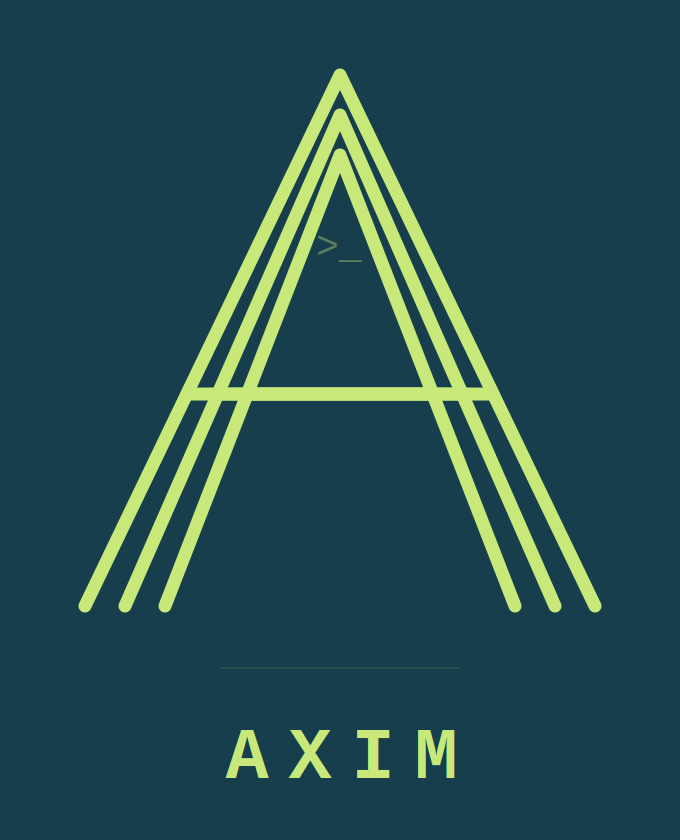

<div align="center">



# Universal CUDA-Free Compute + Graphics Runtime

**Run any SYNAXIM AI model and any GPU workload  on any hardware.**
**NVIDIA · AMD · Intel · Apple silicon. Zero CUDA.**

[](https://github.com/GRRN-MAKER/Aximcomp/actions/workflows/build.yml)
[](https://github.com/GRRN-MAKER/Aximcomp/actions/workflows/codeql.yml)
[](https://github.com/GRRN-MAKER/Aximcomp/actions/workflows/docs.yml)
[](LICENSE)
[](CONTRIBUTING.md)
[](https://www.python.org)
[](https://www.rust-lang.org)

</div>

---

## Contents

- [Overview](#overview)
- [Why AXIM](#why-axim-vs-rocm--hip--sycl--zluda)
- [Supported hardware](#supported-hardware)
- [Repository layout](#repository-layout)
- [Getting started](#getting-started)
  - [Quick start](#quick-start)
  - [Device report](#device-report)
  - [Port CUDA code](#port-cuda-code-one-include)
  - [Render a game frame](#render-a-game-frame)
- [Building from source](#building-from-source)
- [Testing](#testing)
- [Component status](#component-status)
- [Roadmap](#roadmap)
- [Documentation](#documentation)
- [Contributing](#contributing)
- [Security](#security)
- [License](#license)

---

## Overview

AXIM is a **CUDA-free compute and graphics runtime**. You write a kernel once and it
runs on every device — NVIDIA, AMD, Intel, and Apple silicon — for **AI inference, HPC,
and games**, without ever depending on CUDA.

```
GPU compute + graphics : Vulkan (SPIR-V) / Metal (MSL)   ← vendor-neutral
CPU compute            : AVX-512 / AVX2 / NEON SIMD       ← vendor-neutral
CUDA compatibility     : AXIM-HIP shim (port CUDA in 1 #include)
```

> **One kernel. Every device.**

AXIM is the runtime layer of the GRRN post-transformer stack. It is purpose-built to run
[SYNAXIM](https://github.com/GRRN-MAKER/SYNAXIM) models — including the `.symb` INT4
weight format — while remaining a fully general compute + graphics backend for any
workload.

---

## Why AXIM (vs ROCm / HIP / SYCL / ZLUDA)

AMD's ROCm/HIP translates CUDA → HIP (AMD-only). Intel's SYCL migrates CUDA → SYCL. ZLUDA intercepts CUDA binaries. **AXIM never touches CUDA at all** — it compiles straight to vendor-neutral targets and also offers a CUDA-compat shim for easy porting.

| | ROCm/HIP | SYCL | ZLUDA | **AXIM** |
|--|----------|------|-------|----------|
| Method | Translate CUDA→HIP | Migrate CUDA→SYCL | Binary intercept | **Native, no CUDA** |
| GPU targets | AMD only | Any (SYCL) | AMD/Intel | **Nvidia + AMD + Intel + Apple** |
| CPU compute | — | oneAPI | — | **AVX-512 / AVX2 / NEON** |
| Graphics/gaming | via extra libs | — | — | **Built-in (Vulkan/Metal render)** |
| CUDA porting | HIPIFY | SYCLomatic | (none) | **AXIM-HIP `#include`** |
| Dependency | ROCm | oneAPI | CUDA runtime | **None** |
| Language | C++ | C++ | binary | **Python + Rust + C++** |

---

## Supported hardware

AXIM selects a backend at runtime based on the hardware it detects. No vendor SDK lock-in.

| Vendor | Compute path | Graphics path | Status |
|--------|--------------|---------------|--------|
| **Apple silicon** (M1–M4) | Metal (MSL) · NEON SIMD | Metal render | ✅ verified live (M3) |
| **NVIDIA** (GeForce/RTX/Data Center) | Vulkan (SPIR-V) | Vulkan render | 🔷 shaders ready, runtime WIP |
| **AMD** (Radeon/Instinct) | Vulkan (SPIR-V) | Vulkan render | 🔷 shaders ready, runtime WIP |
| **Intel** (Arc/Xe/iGPU) | Vulkan (SPIR-V) | Vulkan render | 🔷 shaders ready, runtime WIP |
| **x86-64 CPU** (Intel/AMD) | AVX-512 / AVX2 SIMD | — | ✅ code complete |
| **ARM CPU** (Apple/Ampere/NVIDIA Grace) | NEON SIMD | — | ✅ verified live (Apple M3 **+ NVIDIA GH200 Grace**) |

> Backends are picked automatically (`device="auto"`) or forced (`device="gpu"` / `"cpu"`).

---

## Repository layout

```
Aximcomp/
├── axim_compiler/            ← THE COMPILER / RUNTIME
│   ├── ir/                   AXIM IR (SYNAXIM-native op set)
│   ├── frontend/             @axim.kernel + SYNAXIM ops (Python)
│   ├── orchestrator/         device dispatch (Rust) + Python bridge
│   ├── backend_cpu/          AVX-512 / AVX2 / NEON SIMD (C++)  ✅ built
│   │   └── (aximBLAS + aximDNN tuned math libraries)
│   ├── backend_gpu/          Vulkan / Metal compute (C++/ObjC++)  ✅ Metal live
│   │   └── shaders/          MSL + GLSL/SPIR-V compute shaders
│   ├── graphics/             game render pipeline (Metal/Vulkan)  ✅ Metal live
│   ├── hip/                  AXIM-HIP CUDA-compat shim (C++)  ✅ built
│   ├── loader/               .symb model loader (SYNAXIM/Magnus)  ✅
│   ├── tools/                aximinfo (rocminfo-style device report)
│   ├── examples/             hello_world, synaxim_on_axim
│   ├── tests/                pipeline, synaxim, loader
│   └── pyproject.toml        maturin/PyO3 packaging
├── docs/                     documentation site (MkDocs)
├── wiki/                     GitHub wiki pages
└── .github/                  CI: build, CodeQL, docs, Dependabot
```

---

## Getting started

### Quick start

```python
import axim_compiler as axim

# 1. See your devices
axim.hello()          # CPU: NEON | GPU: Metal (Apple M3) — CUDA-free

# 2. Run a SYNAXIM INT4 matvec on the GPU
out = axim.int4_matvec(x, packed, scales, zeros,
                       out_dim, in_dim, group_size, device="gpu")

# 3. Or a custom kernel — same code, any device
@axim.kernel
def add(a, b):
    return a + b
axim.run(add, [1,2,3], [4,5,6], device="auto")   # → [5,7,9]
```

### Device report

```bash
python3 axim_compiler/tools/aximinfo.py
```

### Port CUDA code (one include)

```cpp
#define AXIM_HIP_CUDA_ALIASES
#include "axim_hip.h"
cudaMalloc(&d, n);   // → runs on AXIM (any GPU/CPU), zero CUDA
```

### Render a game frame

```python
# graphics/build/libaxim_gfx.dylib renders triangles on the Metal GPU,
# sharing the device with AXIM compute — AI + physics + render on one queue.
```

---

## Building from source

```bash
# CPU SIMD backend (NEON on ARM, AVX2/512 on x86)
cd axim_compiler/backend_cpu && mkdir -p build
c++ -std=c++14 -O3 -fPIC -shared -Iinclude src/axim_cpu.cpp -o build/libaxim_cpu.dylib

# Metal GPU backend (Apple silicon)
cd ../backend_gpu && mkdir -p build
clang++ -std=c++17 -ObjC++ -O3 -fPIC -shared -framework Metal -framework Foundation \
    -Iinclude src/axim_metal.mm -o build/libaxim_metal.dylib

# Graphics (game render)
cd ../graphics && mkdir -p build
clang++ -std=c++17 -ObjC++ -O3 -fPIC -shared -framework Metal -framework Foundation \
    -Iinclude src/axim_gfx_metal.mm -o build/libaxim_gfx.dylib

# GPU shaders (Vulkan SPIR-V + Metal metallib)
cd ../backend_gpu/shaders && ./build_shaders.sh

# Python + Rust package (needs Rust + maturin)
cd ../.. && maturin develop --features python
```

---

## Testing

```bash
python3 axim_compiler/tests/test_pipeline.py    # 12 checks — IR + dispatch
python3 axim_compiler/tests/test_synaxim.py     #  5 checks — SYNAXIM ops
python3 axim_compiler/tests/test_loader.py      #  7 checks — .symb loader
python3 axim_compiler/examples/synaxim_on_axim.py  # full layer forward
```

---

## Component status

> Verified on Apple M3 (macOS, arm64).

| Component | Status |
|-----------|--------|
| AXIM IR (SYNAXIM-native) | ✅ |
| Python frontend `@axim.kernel` | ✅ |
| CPU backend (NEON verified) | ✅ live |
| GPU backend Metal (M3 verified) | ✅ **live** |
| GPU shaders MSL + GLSL/SPIR-V | ✅ source complete |
| Graphics render (M3 verified) | ✅ **live** |
| AXIM-HIP CUDA shim | ✅ CUDA source runs |
| `.symb` loader (SYNAXIM/Magnus) | ✅ verified |
| aximinfo device tool | ✅ |
| Rust orchestrator + PyO3 | ✅ code complete (needs Rust to build) |
| Vulkan runtime executor (SPIR-V loader) | ✅ implemented (measurement pending) |
| Zero-copy graphics ↔ compute buffers | ✅ implemented (Metal live) |
| `maturin` wheels (Linux/macOS/Windows) | ✅ CI-built |
| aximBLAS L1 (sscal/snrm2/sasum/isamax) | ✅ |
| aximDNN (silu/rmsnorm/swiglu) | ✅ |

**INT4 matvec: CPU (NEON) == GPU (Metal) exact match, zero CUDA.**

> **Note.** The runtime is feature-complete across CPU (SIMD) and GPU (Vulkan/Metal). The
> Vulkan cross-vendor path is fully implemented **and executed in CI** — a self-test runs the
> full `VkInstance → dispatch → readback` path against a real Vulkan ICD (Mesa **Lavapipe**,
> software Vulkan) on the GPU-less runner and checks the result. The one remaining step is
> **latency/throughput measurement on physical NVIDIA/AMD/Intel silicon**, done via an
> optional self-hosted GPU runner (same self-test binary). Verified live today on Apple M3.

---

## Roadmap

- [x] Vulkan runtime executor (SPIR-V loader) for NVIDIA / AMD / Intel GPUs
- [x] Wire graphics ↔ compute shared buffers (zero-copy AI-in-games)
- [x] `maturin` wheels built in CI (Linux / macOS / Windows)
- [x] Expanded aximBLAS / aximDNN kernel coverage
- [x] Windows (Vulkan) support + PowerShell shader build
- [ ] Measure cross-vendor GPU performance on NVIDIA / AMD / Intel hardware
- [ ] `aximify` tool (search-and-replace CUDA → AXIM, HIPIFY-style)
- [ ] Publish `maturin` wheels to PyPI
- [ ] DirectX 12 SPIR-V consumer (optional Windows path)

---

## Documentation

Full documentation is built with [MkDocs](https://www.mkdocs.org/) and published via
GitHub Pages.

- **Docs site** — see the [`docs/`](docs/) directory (`mkdocs serve` to preview locally)
- **Wiki** — see the [`wiki/`](wiki/) directory and the repository
  [Wiki tab](https://github.com/GRRN-MAKER/Aximcomp/wiki)

Key pages: architecture overview, IR reference, the `@axim.kernel` API, backend
internals (CPU SIMD, Metal, Vulkan), the AXIM-HIP CUDA shim, the `.symb` loader, and the
tuned aximBLAS / aximDNN libraries.

---

## Contributing

We welcome and encourage contributions to both the AXIM code and documentation. Please
read the **[Contributing Guide](CONTRIBUTING.md)** before you start.

In short:

- **Issues** — search [existing issues](https://github.com/GRRN-MAKER/Aximcomp/issues)
  first; if yours is new, file it with full detail (OS, CPU/GPU vendor, driver versions,
  command output).
- **Pull requests** — target the `main` branch, ensure your code builds, and include the
  log of a successful test run. New features must ship with a test or example.
- **CI** — all checks (Build, CodeQL) must pass before merge.
- **New features** — propose them in
  [Discussions](https://github.com/GRRN-MAKER/Aximcomp/discussions) first.
- **Docs** — update [`docs/`](docs/) / [`wiki/`](wiki/) for any new feature or API.

> By creating a PR, you agree to license your contribution under the [Apache 2.0](LICENSE)
> terms.

---

## Security

Please review our [Security Policy](SECURITY.md). Report vulnerabilities privately via
GitHub's private vulnerability reporting — **do not** open public issues for security
reports.

---

## License

AXIM is released under the [Apache License 2.0](LICENSE).

---

<div align="center">

*Part of the GRRN post-transformer stack — AXIM is the runtime; [SYNAXIM](https://github.com/GRRN-MAKER/SYNAXIM) is the engine.*

</div>
